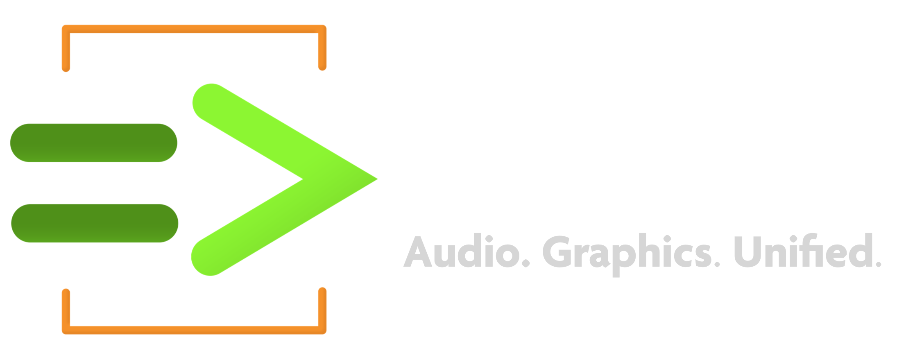

<div align="center">
<!-- Add ChuGL logo -->
<!--  -->



Version 0.1.0  [alpha]
<a href="https://ccrma.stanford.edu/~azaday/"> Andrew Zhu Aday </a> and <a href="https://ccrma.stanford.edu/~ge/">Ge Wang</a> 


## ChuGL == ChucK Graphics

</div> <!-- end center -->

<p align="justify">
ChuGL is a unified audiovisual programming tool built into the ChucK language. It combines ChucK's <b>strongly-timed, concurrent programming model</b> and <b>real-time audio synthesis</b> capabilities with a <b>hardware-accelerated 3D graphics engine and API</b>. At its core is a scenegraph architecture that provides <b>low-latency, high performance audiovisual synchronization at frame-level accuracy</b>.
</p>

___

## Installation

1. **Get the latest ChucK (requires 1.5.1.5 or higher)**
https://chuck.stanford.edu/release/
2. **Get the latest ChuGL chugin**
https://chuck.stanford.edu/release/alpha/chugl/

### MacOS

Run the .pkg file, which will install the ChuGL chugin in the appropriate location


### Windows

Download the `ChuGL.chug` binary from the installation links above and move it to `C:\Users\<usename>\Documents\ChucK\chugins\`

## Running

**Note:** Currently ChuGL only supports command-line chuck. MiniAudicle support to come soon. 

You can run commandline ChucK with the option `--chugin-probe` to check which chugins are found and properly loaded.

### Minimal Example

If the chugin is properly loaded, running the following example via commandline chuck will open a blank window. Press `esc` to exit. 


```cpp
while (true) { GG.nextFrame() => now; }
```

Congrats, you now have ChuGL properly installed!

## Learning Resouces

- [API Reference](https://chuck.stanford.edu/chugl/api/)
- [Examples](https://chuck.stanford.edu/chugl/examples/)
- [ChuGL Tutorial](https://chuck.stanford.edu/chugl/doc/tutorial.html)